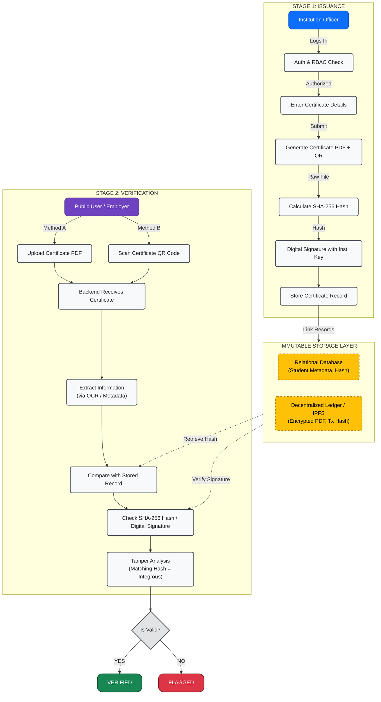

# AVFA System Architecture Flow

This document details the operational workflow of the **Authenticity Validator for Academia (AVFA)** platform (SIH25029).

It visualizes the complete lifecycle of an academic credential, divided into two distinct logical stages: **Issuance** by authenticated institutions and **Verification** by public users (e.g., employers).

---

## Technical Workflow Diagram

### Operational Flowchart

***Workflow Step-by-Step Description***

#Stage 1: Issuance Workflow (Institution Side)

1)Institution Authenticates: Authorized personnel log into the AVFA portal via a secure Role-Based Access Control (RBAC) system.

2)Enter Details: Academic records (student name, degree, GPA, issue date) are entered via UI forms or bulk CSV upload.

3)Generate Certificate: The system automatically generates a PDF certificate and embeds a cryptographic QR code containing a unique ID and a verification URL.

4)Calculate SHA-256 Hash: A unique 64-character hexadecimal SHA-256 hash is generated from the raw binary content of the specific PDF file. If one pixel changes, the hash changes completely.

5)Digital Signature: The institution signs the hash with its private cryptographic key, proving ownership and origin.

6)Store Record (Immutable Ledger):

->Database: Student metadata and the SHA-256 hash are stored in the secure relational database.

->IPFS/Blockchain: The encrypted PDF is uploaded to IPFS (InterPlanetary File System) for decentralized storage, and a reference (transaction hash) is committed to the blockchain simulation.

#Stage 2: Verification Workflow (Public Side)

1)User Initiates: A third-party verifier (employer, another university) accesses the public verification page.

2)Input Method: The user chooses to Upload the PDF certificate or Scan the QR code on a printed document.

3)Backend Processing: The AVFA backend receives the request.

4)Extract Information:

->For PDFs: The system extracts document metadata or uses Optical Character Recognition (OCR) to parse key fields.

->For QRs: The system reads the embedded ID.

5)Compare with Stored Record: The backend queries the database for the unique certificate reference.

6)Check Hash/Signature:

7)The system calculates the SHA-256 hash of the uploaded document.

->It retrieves the stored hash and signature for the matching certificate ID.

->Tamper Analysis: The system performs a bitwise comparison. If the generated hash matches the stored hash exactly, the document is integral (original). If they differ, it has been modified.

8)Final Outcome:

->VERIFIED: The certificate is original, valid, and has not been altered or revoked.

->FLAGGED: The certificate is missing from the registry, has been modified (tampered), has an invalid signature, or has been revoked.
